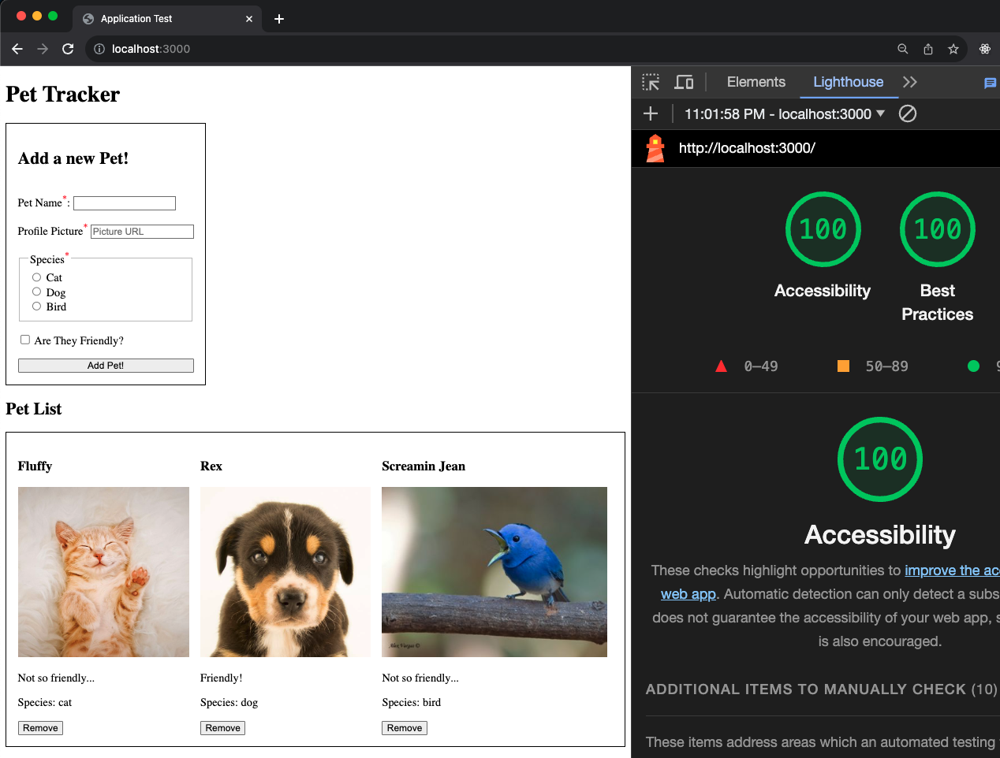

# Lead Instructor Take Home Challenge

- [Lead Instructor Take Home Challenge](#lead-instructor-take-home-challenge)
- [Challenge Overview](#challenge-overview)
- [Challenge Rules](#challenge-rules)
- [Requirements](#requirements)
  - [CSS](#css)
  - [Client Rendering](#client-rendering)
  - [Client Functionality](#client-functionality)
  - [Accessibility](#accessibility)
  - [JSON API](#json-api)
  - [Database](#database)
- ["I can't do everything this project is asking"](#i-cant-do-everything-this-project-is-asking)
- ["I can do more than this!"](#i-can-do-more-than-this)
- [AI](#ai)
- [Submission](#submission)

We've selected this project because, despite its small size, it hits all the major aspects of our curriculum:

- Client
- Server
- Database

We hope you have fun making it!

# Challenge Overview
Your task is to create a "Pet Tracker" application that allows us to:

- See all our existing pets
- Add new pets
- Remove pets

This is a CRUD app without the update functionality. We want to be respectful of your time, and if you can get the other three working, we know you could probably get update working as well.



There are more example pictures in the `images` folder of this repo.

# Challenge Rules
It's true that Marcy has a specific stack that we teach, but we aren't requiring you to use it. You can use any tech stack you want to complete this challenge, as long as you hit some big points:

- You use client side JS and a JSON API server that talks to a DB.

OR

- You build a fullstack, SSR application that connects to a DB

So you could build this project with React (or vanilla JS), Express, and Postgres and host both your JSON routes and static assets from a single server (marcy's Stack). HOWEVER! You could use a server for your frontend, and another for your backend. Maybe it's all Ruby on Rails! MongoDB anyone?

> It doesn't matter how you build this project, only that you complete the listed requirements.

# Requirements
Here's a list of all the individual requirements that we'd like you to hit for this challenge. What you see is what you get, these are the only aspects we'll be looking at in order to get as much of an apples-to-apples comparison between candidates as possible.

## CSS
This is not a css challenge. CSS is not super hard to pick up, but it certainly is a black hole for time. Please either ignore CSS entirely or throw this style tag into your project and call it a day:

```html
<style>
  img { height: 15rem; }
  sup { color: red; }
  form, ul { display: flex; gap: 1rem; padding: 1rem; border: .1rem solid #000; }
  form { flex-direction: column; width: fit-content; }
  #pet-list { flex-wrap: wrap; list-style: none; }
</style>
```

## Client Rendering
You may handwrite your HTML, generate it with JS, or use a template system, but the final client output must hit these requirements:

- [ ] You must update the `title` of the page to "Application Submission"
- [ ] There is a heading that says "Pet Tracker"
- [ ] There is a form on the page
  - [ ] There is a text input for the pet name
  - [ ] There is a label that says "Pet Name"
  - [ ] There is a text input for the pet profile picture url
  - [ ] There is a label that says "Profile Picture"
  - [ ] The placeholder text for the profile picture input is "Picture URL"
  - [ ] There is a fieldset with a legend of "Species"
  - [ ] There is a radio input with a label of "Dog"
  - [ ] There is a radio input with a label of "Cat"
  - [ ] There is a radio input with a label of "Bird"
  - [ ] There is a checkbox input with a label of "Are they friendly?"
  - [ ] There is a submit button that says "Add Pet!"
  - [ ] The name, profile picture, and species are all HTML required fields
  - [ ] The required fields have a red asterisk in their labels
  - [ ] All field values are empty on page load
- [ ] There is another heading that say "Pet List"
- [ ] There is a list of all the pets
  - [ ] Each pet is organized into some kind of a card
  - [ ] Each pet has a name
  - [ ] Each pet has a profile picture
  - [ ] If the pet is friendly, the pet card says "Friendly!", otherwise it says "Not so friendly..."
  - [ ] Each pet has a species formatted like "Species: dog"
  - [ ] Each pet has a "remove" button


## Client Functionality

- [ ] When the form is submitted, the new pet is added to the list
- [ ] The form cannot be submitted if a required field is empty
- [ ] After the form is submitted, the form is cleared
- [ ] When the remove button is clicked, the pet is removed from the list

## Accessibility
At Marcy we are extremely passionate about an open and accessible web. There are some basic accessibility requirements that we'd like you to hit:

- [ ] The `main` tag is used correctly
- [ ] Headings are used in the appropriate places on the page
- [ ] Heading are also in the right order
- [ ] Every label is properly associated with its input
- [ ] Semantic tags are used to properly display all the pets
- [ ] Every pet image has an `alt` attribute with the pet's name

If you *really* want to go the extra mile, run a check with lighthouse and score a 90% or better. If you don't know what that is, don't worry about it! As long as you hit the requirements above, you're all set.


## JSON API
As this technique is part of the Marcy curriculum, if you know how to make one, please do. If you're using SSR, then all of this is handled with the client functionality requirements.

- [ ] Route names are RESTful
- [ ] There is a route that returns all the pets
- [ ] There is a route that adds a new pet
- [ ] There is a route that removes a pet
- [ ] The response of the route that adds a new pet is the new pet data

## Database
- [ ] The data is persisted in a database of some kind
- [ ] There is a query that returns all the pets
- [ ] There is a query that adds a new pet
- [ ] There is a query that removes a pet
- [ ] The response of the query that adds a new pet is the new pet data
- [ ] If necessary, there is a process to build the required DB infrastructure
  - e.g. a query or migration file I can run if you're using SQL

# "I can't do everything this project is asking"
This is a simple fullstack application, and we are a fullstack program. We hope that you have at least some experience with all the the requirements listed above.

However, this is only one part of your application. So, if you have to substitute a section to get the project working, that is alright, provided you do it correctly. Here are the fallback configurations for this project:

- If you do not know databases, you can use variables that exist on your server to persist data.
- If you don't know databases *or* servers, please use `localStorage` to persist data. **This configuration is not ideal, only use if you must**

# "I can do more than this!"
That is great to hear but ***please do not***. Complete the given requirements with readable code and then move on. Remember, this is *not* the only part of your application. You also have to prepare a 30 min coding challenge lesson. If you're looking for the place that your extra elbow grease will pay off, it's planning and executing that lesson.

This project is about seeing that you understand the core concepts, not that you handle every edge case or add bonus features.

# AI
Use it with discretion. Of course its a wonderful tool, but we will be going over your code during our live interview, and if it's clear you can't explain what the robot wrote, that's not going to be a good look. Make sure you understand what your code is doing.

> A partially complete project you fully understand is 100x better than a complete project that you can't explain.

# Submission
Please create new GitHub repo or repos for this challenge. Do not fork this repo, we don't want other applicants to see each other's work. When you're done, please email us the links to your work as outlined in your email. **THERE IS NO NEED TO DEPLOY YOUR APP.** I'm simply going to clone your work and run it locally to test it.

If you use a non Node and SQL based stack, I would appreciate some information in a README that tells me how I can actually run your project. We will also ask you to run your project during your onsite interview process so we can talk to you about it.

Good luck, and I can't wait to see what you build!
- Mike Cronin, Director of Curriculum at The Marcy Lab School


